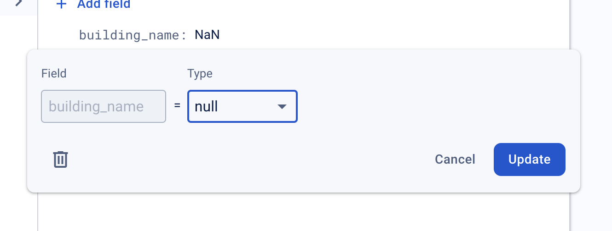

# ShopPeas
SC2006 Software Engineering Project as a Smart Nation Initiative

# Developer Notes

## Front End

Install simulator on your computer or Expo on your phone.

    npx expo start

OR

    npm start

## Back End

Create virtual env in backend folder. Pip install libraries only after activating the virtual env.

    cd backend
    python -m venv env
    source ./env/bin/activate (mac)
    env\Scripts\activate (windows)

Install libraries if you don't have

    pip install -r requirements.txt

Update libraries when you make changes

    pip freeze > requirements.txt

Run app.py file and go to http://127.0.0.1/5000.

    python app.py

## Database

Create virtual env in utils folder. Pip install libraries only after activating the virtual env.

    cd utils
    python -m venv env
    source ./env/bin/activate (mac)
    env\Scripts\activate (windows)

Install libraries if you don't have

    pip install -r requirements.txt

Update libraries when you make changes

    pip freeze > requirements.txt

Download the json config file I sent and put it in your utils folder.

Store CSV file in data, columns in the first row.

Write your functions in the add_records_db.py file, I commented out a @saffron and @jed, those are the functions for you guys. Use **underscore** for the fields (e.g., first_name) and collections (e.g., wholesaler_products)

If some fields have to be set to null, my current code doesn't handle that ... so I went in manually to change.

Run file based on the records you want to add. I used arguments so that you can control what parameters to run on in the CLI. Replace 'wholesaler' with your collection name, replace 'wholesalers.csv' with your csv file name.

    python add_records_db.py --collection wholesaler --input_csv ./data/wholesalers.csv
