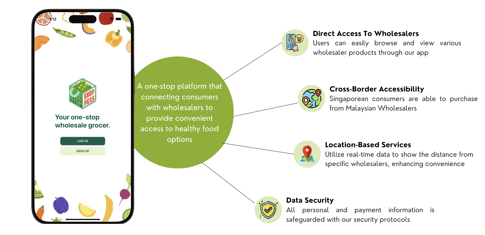

# ShopPeas


As part of our Software Engineering module (SC2006) at NTU, our 6-member team, Peas Pte Ltd, developed a Mobile Application that aligns with Singapore's Smart Nation Initiative.



ShopPeas is a one-stop platform connecting consumers with wholesalers. Our goal is to provide easy access to healthy food options directly from wholesalers. Users can effortlessly browse for specific products or wholesalers. To help users make informed decisions, they can compare the prices, number of stocks, and distance of each wholesaler from their location. An added feature of our app is our cross-border accessibility, which allows Singaporeans to purchase directly from Malaysian wholesalers. Throughout the process, we ensure the app's efficiency, robustness, and the secureness of their personal data.

## Table of Contents

1. [Folder Structure](#folder-structure)
2. [Tech Stack](#tech-stack)
3. [System Design](#system-design)
4. [Datasets and Real-Time APIs](#data-api)
5. [Set Up](#setup)
    1. [Front-End](#frontend)
    2. [Back-End](#backend)
6. [Documentation](#documentation)
7. [Contributors](#contributors)

<a id='folder-structure'></a>

## Folder Structure

```
assets/              # Images for the README file.
backend/             # Back-end files
demo/                # Presentation Slides and Demo Video
diagrams/            # System Design Diagrams
documentation/       # SRS, Use Case Document, API Documentation, and Javadocs
frontend/            # Front-end files
utils/               # Utility files to create records for firestore
```

<a id='tech-stack'></a>

## Tech Stack


We used **React Native** for our front-end, **Spring Boot** for our back-end, and **Firestore Database** as our database.

<a id='system-design'></a>

## System Design


To provide a high-level overview using our system layered architecture diagram, the presentation layer encompasses our front-end UI pages. The following three layers follows the controller-service-repository pattern for separation of concerns, as reflected in our backend organisation. Finally, the last layer is the database layer.

<a id='data-api'></a>

## Datasets and Real-Time APIs

- [Healthy Food Product Information](https://data.gov.sg/datasets/d_6725eed000bf5b3c5d310eb08de0851f/view): Healthier Choice Symbol Product List dataset from data.gov.sg.
  - Since there were no images provided, we web scraped the images using `bing_image_downloader`.
- [OneMap API](https://www.onemap.gov.sg/apidocs/): To calculate the distance and duration between a consumer and wholesaler.
- [Currency Conversion API](https://currencyapi.com/): To get the real-time currency conversion rate and convert the currency for wholesalers overseas.

<a id='setup'></a>

## Set Up

<a id='frontend'></a>

### Front-End

1. Install an emulator on your computer. If you are using a MacOS, install the simulator with Xcode. If you are using Windows, install the emulators with Android Studio.

2. Create an `.env` file in the `frontend/` folder and fill in the respective fields. The REACT_APP_BACKEND_* environment variables indicate the respective API path to use and will call the respective controllers.

       REACT_APP_API_KEY=<your-firestore-apikey>
       REACT_APP_BACKEND_API=http://localhost:8080/
       REACT_APP_BACKEND_AUTH=auth
       REACT_APP_BACKEND_CONSUMER=consumer
       REACT_APP_BACKEND_WHOLESALER=wholesaler
       REACT_APP_BACKEND_PRODUCT=products
       REACT_APP_BACKEND_WHOLESALER_PRODUCT=wholesaler_product
       REACT_APP_BACKEND_CART=cart
       REACT_APP_BACKEND_HISTORY=history
       REACT_APP_BACKEND_TRANSACTION=transaction
       REACT_APP_BACKEND_PAYMENT=payment
       REACT_APP_ONEMAP_API_KEY=<your-onemap-apikey>

3. Install required packages for the app to run.

       npm install

4. Run the front-end.

       npx expo start

<a id='backend'></a>

### Back-End

1. Download Java SE 22 [link](https://www.oracle.com/sg/java/technologies/downloads/).

2. Open the `backend` folder in your IDE. We used IntelliJ IDEA.

3. In the [config](./backend/src/main/resources/config) folder, add these 3 JSON files that will contain the resources to communicate with external services. The first is the Currency API JSON file. Create an account with [currencyapi](https://currencyapi.com/) and get the API key.

       # currencyapi.json file
       {
              "apiKey": "<your-currency-api-key>"
       }

4. Create a [OneMap](https://www.onemap.gov.sg/apidocs/) account and get the API key.

       # onemapapi.json file
       {
              "apiKey": "<your-onemap-api-key>"
       }

5. You can generate the `firebase-service-account.json` file by selecting Service accounts for Firestore Database in your Firebase console, and generating a new private key.

       # shoppeas-firebase-service-account.json
       {
              "type": "service_account",
              "project_id": "<your-project-id>",
              "private_key_id": "<your-private-key-id>",
              "private_key": "<your-private-key>",
              "client_email": "<your-client-email>",
              "client_id": "<your-client-id>",
              "auth_uri": "<your-auth-uri>",
              "token_uri": "<your-token-uri>",
              "auth_provider_x509_cert_url": "<your-auth-provider-cert-url>",
              "client_x509_cert_url": "<your-client-cert-url>",
              "universe_domain": "googleapis.com"
       }

6. Run the [ShoppeasApplication.java](./backend/src/main/java/com/peaslimited/shoppeas/ShoppeasApplication.java) file. The back-end should be running on http://localhost:8080/.

<a id='documentation'></a>

## Documentation

We have documented our solution in the following files which can be found in the `documentation` folder:

1. System Requirements Specification Document

2. Use Case Document

3. API Documentation with `SwaggerUI`. You can access the documentation while running the backend by entering http://localhost:8080/swagger-ui/index.html. Alternatively, you can refer to our [api_docs.html](./documentation/api_docs.html) for our HTML version or [API Documentation.pdf](./documentation/API%20Documentation.pdf) for our PDF version.

4. Backend Functions Documentation with `Javadocs`. You can access the documentation through the [index.html](./documentation/javadocs) file here.

<a id='contributors'></a>

## Contributors

| Name                        | GitHub Username   | Role   |
|-----------------------------|-------------------|--------|
| Rachel Tan                  | [Racheltmz](https://github.com/Racheltmz) | Full Stack Developer |
| Saffron Lim                 | [Ripleyyyyy](https://github.com/Ripleyyyyy) | Back-End Developer |
| Lee Jedidiah                | [jeddd77](https://github.com/jeddd77) | Back-End Developer |
| Jun Chao                    | [GrassjellyMoab](https://github.com/GrassjellyMoab) | Front-End Developer |
| Winnie Koh                  | [flumbles](https://github.com/flumbles) | Front-End Developer |
| Yi Xuan                     | [imaracoonwelp](https://github.com/imaracoonwelp) | Front-End Developer |
